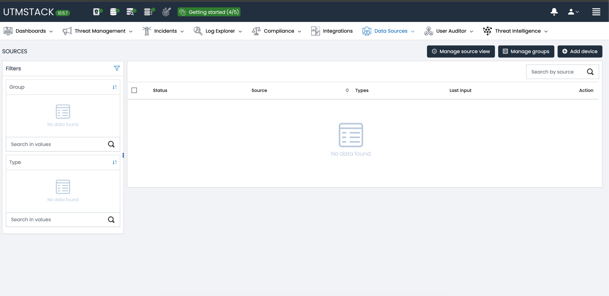

#### 1. Посмотреть что такое UTM-стек https://github.com/utmstack/UTMStack/tree/main Понять что это такое и зачем нужно.

UTMStack - Unified Threat Management

Предоставляет заинтересованным лицам сервисы по кибербезопаности
Включает в себя *Анализ и управление логами*, *обнаружение и управление угрозами*, *корреляция в режиме реального времени*, мониторинг облачных 
сервисов, управление уязвимостями, классификация и треккинг файлов, работа с инцидентами и др.

Архитектурно может представлять собой агент-серверную структуру в распределенной системе

Поддерживает популярный стек технологий (happroxy, nginx, PostgreSQL, Elasticsearch и др)


#### 2. Установка сервера 

В качестве первой пробы необходимо установить сервер на виртуальную машину


Использовал **машину** со следующими характеристиками:

- Архитектура - ADM64
- 6 CPU
- 20Gb RAM
- 80Gb SSD

Все действия выполнялись под `tmux`, для сохранения состояния и избежания потерь при 
сбросе ssh-соединения

```bash
root@neqrjjqxdo:~# free -h
total           used        free      shared  buff/cache   available
Mem:            19Gi       188Mi        19Gi       0.0Ki       152Mi        19Gi
Swap:           0B          0B          0B
```

```bash
root@neqrjjqxdo:~# cat /proc/cpuinfo  | grep processor  | wc -l
6
```


```bash
Filesystem      Size  Used Avail Use% Mounted on
/dev/vda1        78G  1.3G   77G   2% /
```
Предварительно пробросил порты на локальную машину через

```bash
ssh root@<IP> -L 8080:localhost:443
```

Таким образом, сервер будет находится на локальной машине под https://localhost:8080 (с самоподписанными сертификатами)

Установил `go`

```bash
curl -O https://dl.google.com/go/go1.21.1.linux-amd64.tar.gz
sha256sum  go1.21.1.linux-amd64.tar.gz
>>> b3075ae1ce5dab85f89bc7905d1632de23ca196bd8336afd93fa97434cfa55ae  go1.21.1.linux-amd64.tar.gz
tar -xvf go1.21.1.linux-amd64.tar.gz -C /usr/local
chown -R root:root /usr/local/go
export PATH=$PATH:/usr/local/go/bin
source ~/.bashrc
```

```bash
root@neqrjjqxdo:~# go version
go version go1.21.1 linux/amd64
```

Склонировал UTMStack из официального репозитория


Собрал бинарник через 
```bash
go build -o installer 
```
в ~installer/

   <details>
   <summary>Процесс Установки сервера</summary>
   <pre>
    go: downloading go1.22.1 (linux/amd64)
    go: downloading github.com/lib/pq v1.10.9
    go: downloading github.com/levigross/grequests v0.0.0-20231203190023-9c307ef1f48d
    go: downloading github.com/cloudfoundry/gosigar v1.3.60
    go: downloading github.com/shirou/gopsutil/v3 v3.24.5
    go: downloading gopkg.in/yaml.v3 v3.0.1
    go: downloading gopkg.in/yaml.v2 v2.4.0
    go: downloading golang.org/x/net v0.25.0
    go: downloading github.com/google/go-querystring v1.1.0
    go: downloading github.com/tklauser/go-sysconf v0.3.13
    go: downloading golang.org/x/sys v0.20.0
    go: downloading github.com/tklauser/numcpus v0.7.0  
    </pre>
   </details>

При первичном запуске возникает ошибка с netstat 


   <details>
   <summary>Процесс компиляции</summary>
   <pre>
    ### UTMStack Installer ###
    Checking system requirements
    Generating Stack configuration
    Checking system requirements [OK]
    Generating Stack configuration [OK]
    Generating certificates
    Generating certificates [OK]
    Preparing system to run UTMStack
    vm.max_map_count = 262144
    net.ipv6.conf.all.disable_ipv6 = 1
    net.ipv6.conf.default.disable_ipv6 = 1
    net.ipv4.tcp_keepalive_time = 600
    net.ipv4.tcp_keepalive_intvl = 60
    net.ipv4.tcp_keepalive_probes = 3
    Preparing system to run UTMStack [OK]
    Preparing kernel to run UTMStack
    vm.max_map_count = 262144
    net.ipv6.conf.all.disable_ipv6 = 1
    net.ipv6.conf.default.disable_ipv6 = 1
    net.ipv4.tcp_keepalive_time = 600
    net.ipv4.tcp_keepalive_intvl = 60
    net.ipv4.tcp_keepalive_probes = 3
    Preparing kernel to run UTMStack [OK]
    Configuring VLAN
    Get:1 http://public-mirrors.beget.ru/apt/ru.archive.ubuntu.com/ubuntu jammy-security InRelease [129 kB]
    Get:2 http://public-mirrors.beget.ru/apt/ru.archive.ubuntu.com/ubuntu jammy-updates InRelease [128 kB]
    Get:3 http://public-mirrors.beget.ru/apt/ru.archive.ubuntu.com/ubuntu jammy InRelease [270 kB]
    Get:4 https://packages.beget.com/deb/production generic InRelease [4,313 B]
    Get:5 http://public-mirrors.beget.ru/apt/ru.archive.ubuntu.com/ubuntu jammy-security/main amd64 Packages [1,769 kB]
    Get:6 http://public-mirrors.beget.ru/apt/ru.archive.ubuntu.com/ubuntu jammy-security/main Translation-en [291 kB]
    Get:7 http://public-mirrors.beget.ru/apt/ru.archive.ubuntu.com/ubuntu jammy-security/main amd64 c-n-f Metadata [13.2 kB]
    Get:8 http://public-mirrors.beget.ru/apt/ru.archive.ubuntu.com/ubuntu jammy-security/restricted amd64 Packages [2,308 kB]
    Get:9 http://public-mirrors.beget.ru/apt/ru.archive.ubuntu.com/ubuntu jammy-security/restricted Translation-en [398 kB]
    Get:10 http://public-mirrors.beget.ru/apt/ru.archive.ubuntu.com/ubuntu jammy-security/restricted amd64 c-n-f Metadata [572 B]
    Get:11 http://public-mirrors.beget.ru/apt/ru.archive.ubuntu.com/ubuntu jammy-security/universe amd64 Packages [899 kB]
    Get:12 http://public-mirrors.beget.ru/apt/ru.archive.ubuntu.com/ubuntu jammy-security/universe Translation-en [175 kB]
    Get:13 http://public-mirrors.beget.ru/apt/ru.archive.ubuntu.com/ubuntu jammy-security/universe amd64 c-n-f Metadata [19.2 kB]
    Get:14 http://public-mirrors.beget.ru/apt/ru.archive.ubuntu.com/ubuntu jammy-security/multiverse amd64 Packages [37.2 kB]
    Get:15 http://public-mirrors.beget.ru/apt/ru.archive.ubuntu.com/ubuntu jammy-security/multiverse Translation-en [7,588 B]
    Get:16 http://public-mirrors.beget.ru/apt/ru.archive.ubuntu.com/ubuntu jammy-security/multiverse amd64 c-n-f Metadata [228 B]
    Get:17 http://public-mirrors.beget.ru/apt/ru.archive.ubuntu.com/ubuntu jammy-updates/main amd64 Packages [1,988 kB]
    Get:18 http://public-mirrors.beget.ru/apt/ru.archive.ubuntu.com/ubuntu jammy-updates/main Translation-en [349 kB]
    Get:19 http://public-mirrors.beget.ru/apt/ru.archive.ubuntu.com/ubuntu jammy-updates/main amd64 c-n-f Metadata [17.8 kB]
    Get:20 http://public-mirrors.beget.ru/apt/ru.archive.ubuntu.com/ubuntu jammy-updates/restricted amd64 Packages [2,386 kB]
    Get:21 http://public-mirrors.beget.ru/apt/ru.archive.ubuntu.com/ubuntu jammy-updates/restricted Translation-en [410 kB]
    Get:22 http://public-mirrors.beget.ru/apt/ru.archive.ubuntu.com/ubuntu jammy-updates/restricted amd64 c-n-f Metadata [616 B]
    Get:23 http://public-mirrors.beget.ru/apt/ru.archive.ubuntu.com/ubuntu jammy-updates/universe amd64 Packages [1,121 kB]
    Get:24 http://public-mirrors.beget.ru/apt/ru.archive.ubuntu.com/ubuntu jammy-updates/universe Translation-en [260 kB]
    Get:25 http://public-mirrors.beget.ru/apt/ru.archive.ubuntu.com/ubuntu jammy-updates/universe amd64 c-n-f Metadata [26.1 kB]
    Get:26 http://public-mirrors.beget.ru/apt/ru.archive.ubuntu.com/ubuntu jammy-updates/multiverse amd64 Packages [43.3 kB]
    Get:27 http://public-mirrors.beget.ru/apt/ru.archive.ubuntu.com/ubuntu jammy-updates/multiverse Translation-en [10.8 kB]
    Get:28 http://public-mirrors.beget.ru/apt/ru.archive.ubuntu.com/ubuntu jammy-updates/multiverse amd64 c-n-f Metadata [444 B]
    Get:29 http://public-mirrors.beget.ru/apt/ru.archive.ubuntu.com/ubuntu jammy/main amd64 Packages [1,395 kB]
    Get:30 http://nova.clouds.archive.ubuntu.com/ubuntu jammy InRelease [270 kB]
    Get:31 http://public-mirrors.beget.ru/apt/ru.archive.ubuntu.com/ubuntu jammy/main Translation-en [510 kB]
    Get:32 http://public-mirrors.beget.ru/apt/ru.archive.ubuntu.com/ubuntu jammy/main amd64 c-n-f Metadata [30.3 kB]
    Get:33 http://public-mirrors.beget.ru/apt/ru.archive.ubuntu.com/ubuntu jammy/restricted amd64 Packages [129 kB]
    Get:34 http://public-mirrors.beget.ru/apt/ru.archive.ubuntu.com/ubuntu jammy/restricted Translation-en [18.6 kB]
    Get:35 http://public-mirrors.beget.ru/apt/ru.archive.ubuntu.com/ubuntu jammy/restricted amd64 c-n-f Metadata [488 B]
    Get:36 http://public-mirrors.beget.ru/apt/ru.archive.ubuntu.com/ubuntu jammy/universe amd64 Packages [14.1 MB]
    Get:37 http://security.ubuntu.com/ubuntu jammy-security InRelease [129 kB]
    Get:38 https://packages.beget.com/deb/production generic/main amd64 Packages [4,887 B]
    Get:39 http://public-mirrors.beget.ru/apt/ru.archive.ubuntu.com/ubuntu jammy/universe Translation-en [5,652 kB]
    Get:40 http://public-mirrors.beget.ru/apt/ru.archive.ubuntu.com/ubuntu jammy/universe amd64 c-n-f Metadata [286 kB]
    Get:41 http://public-mirrors.beget.ru/apt/ru.archive.ubuntu.com/ubuntu jammy/multiverse amd64 Packages [217 kB]
    Get:42 http://public-mirrors.beget.ru/apt/ru.archive.ubuntu.com/ubuntu jammy/multiverse Translation-en [112 kB]
    Get:43 http://nova.clouds.archive.ubuntu.com/ubuntu jammy-updates InRelease [128 kB]
    Get:44 http://public-mirrors.beget.ru/apt/ru.archive.ubuntu.com/ubuntu jammy/multiverse amd64 c-n-f Metadata [8,372 B]
    Get:45 http://nova.clouds.archive.ubuntu.com/ubuntu jammy-backports InRelease [127 kB]
    Get:46 http://security.ubuntu.com/ubuntu jammy-security/main amd64 Packages [1,771 kB]
    Get:47 http://nova.clouds.archive.ubuntu.com/ubuntu jammy/main amd64 Packages [1,395 kB]
    Get:48 http://nova.clouds.archive.ubuntu.com/ubuntu jammy/main Translation-en [510 kB]
    Get:49 http://security.ubuntu.com/ubuntu jammy-security/main Translation-en [291 kB]
    Get:50 http://security.ubuntu.com/ubuntu jammy-security/main amd64 c-n-f Metadata [13.3 kB]
    Get:51 http://security.ubuntu.com/ubuntu jammy-security/restricted amd64 Packages [2,327 kB]
    Get:52 http://nova.clouds.archive.ubuntu.com/ubuntu jammy/main amd64 c-n-f Metadata [30.3 kB]
    Get:53 http://nova.clouds.archive.ubuntu.com/ubuntu jammy/restricted amd64 Packages [129 kB]
    Get:54 http://nova.clouds.archive.ubuntu.com/ubuntu jammy/restricted Translation-en [18.6 kB]
    Get:55 http://nova.clouds.archive.ubuntu.com/ubuntu jammy/restricted amd64 c-n-f Metadata [488 B]
    Get:56 http://nova.clouds.archive.ubuntu.com/ubuntu jammy/universe amd64 Packages [14.1 MB]
    Get:57 http://security.ubuntu.com/ubuntu jammy-security/restricted Translation-en [400 kB]
    Get:58 http://security.ubuntu.com/ubuntu jammy-security/restricted amd64 c-n-f Metadata [572 B]
    Get:59 http://security.ubuntu.com/ubuntu jammy-security/universe amd64 Packages [899 kB]
    Get:60 http://security.ubuntu.com/ubuntu jammy-security/universe Translation-en [175 kB]
    Get:61 http://security.ubuntu.com/ubuntu jammy-security/universe amd64 c-n-f Metadata [19.2 kB]
    Get:62 http://security.ubuntu.com/ubuntu jammy-security/multiverse amd64 Packages [37.2 kB]
    Get:63 http://security.ubuntu.com/ubuntu jammy-security/multiverse Translation-en [7,588 B]
    Get:64 http://security.ubuntu.com/ubuntu jammy-security/multiverse amd64 c-n-f Metadata [228 B]
    Get:65 http://nova.clouds.archive.ubuntu.com/ubuntu jammy/universe Translation-en [5,652 kB]
    Get:66 http://nova.clouds.archive.ubuntu.com/ubuntu jammy/universe amd64 c-n-f Metadata [286 kB]
    Get:67 http://nova.clouds.archive.ubuntu.com/ubuntu jammy/multiverse amd64 Packages [217 kB]
    Get:68 http://nova.clouds.archive.ubuntu.com/ubuntu jammy/multiverse Translation-en [112 kB]
    Get:69 http://nova.clouds.archive.ubuntu.com/ubuntu jammy/multiverse amd64 c-n-f Metadata [8,372 B]
    Get:70 http://nova.clouds.archive.ubuntu.com/ubuntu jammy-updates/main amd64 Packages [1,988 kB]
    Get:71 http://nova.clouds.archive.ubuntu.com/ubuntu jammy-updates/main Translation-en [349 kB]
    Get:72 http://nova.clouds.archive.ubuntu.com/ubuntu jammy-updates/main amd64 c-n-f Metadata [17.8 kB]
    Get:73 http://nova.clouds.archive.ubuntu.com/ubuntu jammy-updates/restricted amd64 Packages [2,386 kB]
    Get:74 http://nova.clouds.archive.ubuntu.com/ubuntu jammy-updates/restricted Translation-en [410 kB]
    Get:75 http://nova.clouds.archive.ubuntu.com/ubuntu jammy-updates/restricted amd64 c-n-f Metadata [616 B]
    Get:76 http://nova.clouds.archive.ubuntu.com/ubuntu jammy-updates/universe amd64 Packages [1,121 kB]
    Get:77 http://nova.clouds.archive.ubuntu.com/ubuntu jammy-updates/universe Translation-en [260 kB]
    Get:78 http://nova.clouds.archive.ubuntu.com/ubuntu jammy-updates/universe amd64 c-n-f Metadata [26.1 kB]
    Get:79 http://nova.clouds.archive.ubuntu.com/ubuntu jammy-updates/multiverse amd64 Packages [43.3 kB]
    Get:80 http://nova.clouds.archive.ubuntu.com/ubuntu jammy-updates/multiverse Translation-en [10.8 kB]
    Get:81 http://nova.clouds.archive.ubuntu.com/ubuntu jammy-updates/multiverse amd64 c-n-f Metadata [444 B]
    Get:82 http://nova.clouds.archive.ubuntu.com/ubuntu jammy-backports/main amd64 Packages [67.8 kB]
    Get:83 http://nova.clouds.archive.ubuntu.com/ubuntu jammy-backports/main Translation-en [11.1 kB]
    Get:84 http://nova.clouds.archive.ubuntu.com/ubuntu jammy-backports/main amd64 c-n-f Metadata [388 B]
    Get:85 http://nova.clouds.archive.ubuntu.com/ubuntu jammy-backports/restricted amd64 c-n-f Metadata [116 B]
    Get:86 http://nova.clouds.archive.ubuntu.com/ubuntu jammy-backports/universe amd64 Packages [28.8 kB]
    Get:87 http://nova.clouds.archive.ubuntu.com/ubuntu jammy-backports/universe Translation-en [16.5 kB]
    Get:88 http://nova.clouds.archive.ubuntu.com/ubuntu jammy-backports/universe amd64 c-n-f Metadata [672 B]
    Get:89 http://nova.clouds.archive.ubuntu.com/ubuntu jammy-backports/multiverse amd64 c-n-f Metadata [116 B]
    Fetched 71.3 MB in 8s (8,711 kB/s)
    Reading package lists... Done
    Reading package lists... Done
    Building dependency tree... Done
    Reading state information... Done
    The following NEW packages will be installed:
    vlan
    0 upgraded, 1 newly installed, 0 to remove and 22 not upgraded.
    Need to get 10.4 kB of archives.
    After this operation, 51.2 kB of additional disk space will be used.
    Get:1 http://public-mirrors.beget.ru/apt/ru.archive.ubuntu.com/ubuntu jammy/universe amd64 vlan all 2.0.5ubuntu5 [10.4 kB]
    Fetched 10.4 kB in 0s (364 kB/s)
    Selecting previously unselected package vlan.
    (Reading database ... 65997 files and directories currently installed.)
    Preparing to unpack .../vlan_2.0.5ubuntu5_all.deb ...
    Unpacking vlan (2.0.5ubuntu5) ...
    Setting up vlan (2.0.5ubuntu5) ...
    Processing triggers for man-db (2.10.2-1) ...
    NEEDRESTART-VER: 3.5
    NEEDRESTART-KCUR: 5.15.0-118-generic
    NEEDRESTART-KEXP: 5.15.0-118-generic
    NEEDRESTART-KSTA: 1
    2024/09/04 12:25:57 Generating vlan config
    2024/09/04 12:25:57 Applying vlan config
    
    ** (generate:3685): WARNING **: 12:25:57.767: Permissions for /etc/netplan/99-vlan.yaml are too open. Netplan configuration should NOT be accessible by others.
    /etc/netplan/99-vlan.yaml:9:13: Error in network definition: vlan10: interface 'eth0' is not defined
    link: eth0
    ^
    exit status 78
   </pre>
   </details>


Принял решение "выпилить" часть кода связанная с установкой vlan на систему (без namespace и изоляции)


   <details>
   <summary>Процесс устновки сервера</summary>
   <pre>

## UTMStack Installer ###
Checking system requirements
Generating Stack configuration
Checking system requirements [OK]
Generating Stack configuration [OK]
Installing Stack. This may take a while.
Downloading  ghcr.io/utmstack/utmstack/sophos:v10
v10: Pulling from utmstack/utmstack/sophos
Digest: sha256:7a74d14386ed6943a02319922d5a7941424a85f51248760060663425c14cb238
Status: Image is up to date for ghcr.io/utmstack/utmstack/sophos:v10
ghcr.io/utmstack/utmstack/sophos:v10
Downloading  ghcr.io/utmstack/utmstack/backend:v10
v10: Pulling from utmstack/utmstack/backend
eb993dcd6942: Already exists
62ad162d7203: Pull complete
f4348a59bc3e: Pull complete
94aac670c84f: Pull complete
4f6dd396ce5e: Pull complete
5128fd21b245: Pull complete
Digest: sha256:6596ca812fed31fdadd12c908acd2dcd66d621dfdc3d6ffd7264eb70cc4e792b
Status: Downloaded newer image for ghcr.io/utmstack/utmstack/backend:v10
ghcr.io/utmstack/utmstack/backend:v10
Downloading  ghcr.io/utmstack/utmstack/web-pdf:v10
v10: Pulling from utmstack/utmstack/web-pdf
eb993dcd6942: Already exists
071284a75c5b: Pull complete
f34d0b3fef76: Pull complete
2f2bef26e538: Pull complete
97b502054f21: Pull complete
13eacdda3fe5: Pull complete
4d3a767b0abf: Pull complete
09b68de27f6b: Pull complete
c382b5d4069d: Pull complete
deb67d1c69a1: Pull complete
693ab7715c56: Pull complete
1966232d38a1: Pull complete
4649465b8fa3: Pull complete
d4aeabd57d74: Pull complete
78ceb9cf7ad4: Pull complete
dd81478f9839: Pull complete
2613905eb8c3: Pull complete
12b6b68e89e2: Pull complete
937bb3ca2d80: Pull complete
f864656e711a: Pull complete
ebd63b3e51c1: Pull complete
2455df4c5d0d: Pull complete
298c2aa82821: Pull complete
c27ca79eb2e2: Pull complete
6ee14e1a5cb3: Pull complete
Digest: sha256:ee010f6f2144e4e0e90aa150009ed6f7a98676bd744afdbea9e6ae178efbc378
Status: Downloaded newer image for ghcr.io/utmstack/utmstack/web-pdf:v10
ghcr.io/utmstack/utmstack/web-pdf:v10
Downloading  utmstack.azurecr.io/postgres:v10
v10: Pulling from postgres
Digest: sha256:e00300724114989aba53bf3f61b33b5a6947b59ec776724f09306a9967a964ab
Status: Image is up to date for utmstack.azurecr.io/postgres:v10
utmstack.azurecr.io/postgres:v10
Downloading  ghcr.io/utmstack/utmstack/bitdefender:v10
v10: Pulling from utmstack/utmstack/bitdefender
Digest: sha256:d212c7c49dc0fbe5a37a04514040a8a2668c239e89c8f1e3120411a12546dde9
Status: Image is up to date for ghcr.io/utmstack/utmstack/bitdefender:v10
ghcr.io/utmstack/utmstack/bitdefender:v10
Downloading  utmstack.azurecr.io/opensearch:v10
v10: Pulling from opensearch
Digest: sha256:5515f7fa0b7040d1fc00908f23cb429e4bf620fd1db74c7598039904513c1a78
Status: Image is up to date for utmstack.azurecr.io/opensearch:v10
utmstack.azurecr.io/opensearch:v10
Downloading  ghcr.io/utmstack/utmstack/user-auditor:v10
v10: Pulling from utmstack/utmstack/user-auditor
c6a83fedfae6: Pull complete
479e64820c60: Pull complete
4e384a19a9b0: Pull complete
7ed71e81fa34: Pull complete
7beb93379603: Pull complete
7c5f69a49e8e: Pull complete
Digest: sha256:210704ea504989a591267fa05c3af3cbddbecb676eb858a76703437abad11527
Status: Downloaded newer image for ghcr.io/utmstack/utmstack/user-auditor:v10
ghcr.io/utmstack/utmstack/user-auditor:v10
Downloading  ghcr.io/utmstack/utmstack/mutate:v10
v10: Pulling from utmstack/utmstack/mutate
Digest: sha256:9af9bbc6fec8839ac7a9e42fa03ce5d509d7ba6caa36877808207dfae8f1da57
Status: Image is up to date for ghcr.io/utmstack/utmstack/mutate:v10
ghcr.io/utmstack/utmstack/mutate:v10
Downloading  ghcr.io/utmstack/utmstack/office365:v10
v10: Pulling from utmstack/utmstack/office365
Digest: sha256:6d1789a4dc3df682b3b15b645ac1aa60c9b3739f09e02423446e0fdaeef653e2
Status: Image is up to date for ghcr.io/utmstack/utmstack/office365:v10
ghcr.io/utmstack/utmstack/office365:v10
Downloading  ghcr.io/utmstack/filebrowser/filebrowser:v10
v10: Pulling from utmstack/filebrowser/filebrowser
Digest: sha256:f359cb6d52c8871b6c8578fcde728b76352a94f8ae1e02a5591287fec4a7aaa4
Status: Image is up to date for ghcr.io/utmstack/filebrowser/filebrowser:v10
ghcr.io/utmstack/filebrowser/filebrowser:v10
Downloading  ghcr.io/utmstack/utmstack/correlation:v10
v10: Pulling from utmstack/utmstack/correlation
762bedf4b1b7: Pull complete
445a75242059: Pull complete
d1cc2158bbb2: Pull complete
39f82ce98637: Pull complete
3629ceae43a4: Pull complete
5c59bf6a10ce: Pull complete
aea154a8eff5: Pull complete
37f7cbbd1f98: Pull complete
4f4fb700ef54: Pull complete
aa642bf2c46f: Pull complete
3f4fbb4cb904: Pull complete
Digest: sha256:638f2cd95e2f890bb355b65bc322c6e9795650f1eee737e3366c3f24a0570f2c
Status: Downloaded newer image for ghcr.io/utmstack/utmstack/correlation:v10
ghcr.io/utmstack/utmstack/correlation:v10
Downloading  ghcr.io/utmstack/utmstack/agent-manager:v10
v10: Pulling from utmstack/utmstack/agent-manager
762bedf4b1b7: Already exists
e33cc61a434b: Pull complete
66851fed12ae: Pull complete
7c0cb35bffb4: Pull complete
Digest: sha256:18900e25b8d376642bbdfa47c6338465dbedb2b0a880ca2e317330bc29e497e8
Status: Downloaded newer image for ghcr.io/utmstack/utmstack/agent-manager:v10
ghcr.io/utmstack/utmstack/agent-manager:v10
Downloading  ghcr.io/utmstack/utmstack/frontend:v10
v10: Pulling from utmstack/utmstack/frontend
Digest: sha256:0b4a044e579d0fb8f9f640848246f7a958ac0f30699f66e3bd618d583a71b36a
Status: Image is up to date for ghcr.io/utmstack/utmstack/frontend:v10
ghcr.io/utmstack/utmstack/frontend:v10
Downloading  ghcr.io/utmstack/utmstack/aws:v10
v10: Pulling from utmstack/utmstack/aws
Digest: sha256:0e005520f61aae8b7aafad39a3839ca53a4c828355cd871a35879a9dc6420c52
Status: Image is up to date for ghcr.io/utmstack/utmstack/aws:v10
ghcr.io/utmstack/utmstack/aws:v10
Downloading  ghcr.io/utmstack/soc-ai/soc-ai:v10
v10: Pulling from utmstack/soc-ai/soc-ai
Digest: sha256:fa8bc66a1fc390df66ffcded0529ffc7eaa3bb858a820062c723683af8f0c2d9
Status: Image is up to date for ghcr.io/utmstack/soc-ai/soc-ai:v10
ghcr.io/utmstack/soc-ai/soc-ai:v10
Downloading  ghcr.io/utmstack/utmstack/log-auth-proxy:v10
v10: Pulling from utmstack/utmstack/log-auth-proxy
762bedf4b1b7: Already exists
ebfe1661b1b7: Pull complete
bac0b10c3933: Pull complete
7c0cb35bffb4: Pull complete
Digest: sha256:f4fe091362785d1eec6601f43108755e3a4c96f5bdf295d983f2b41c8935eb43
Status: Downloaded newer image for ghcr.io/utmstack/utmstack/log-auth-proxy:v10
ghcr.io/utmstack/utmstack/log-auth-proxy:v10
Downloading  utmstack.azurecr.io/logstash:v10
v10: Pulling from logstash
d5fd17ec1767: Pull complete
9448cb0fbc8d: Pull complete
765a92c6bc8c: Pull complete
870908bbe913: Pull complete
407a9ea64a06: Pull complete
67f11decaf4c: Pull complete
9ced9d307547: Pull complete
2e9e43c62d11: Pull complete
6d831796d231: Pull complete
efc9e220be67: Pull complete
8313a8f0d19c: Pull complete
23616da37891: Pull complete
1224ccf72610: Pull complete
6b473300bc95: Pull complete
f74b39d0f3eb: Pull complete
04c50929f19c: Pull complete
3689413af460: Pull complete
Digest: sha256:c9392f17a7dcc1ef1d2e95ede62697d4aedc9f4f6b2f122f2dbd74bb729fe27b
Status: Downloaded newer image for utmstack.azurecr.io/logstash:v10
utmstack.azurecr.io/logstash:v10
Since --detach=false was not specified, tasks will be created in the background.
In a future release, --detach=false will become the default.
Creating network utmstack_default
Creating service utmstack_log-auth-proxy
Creating service utmstack_user-auditor
Creating service utmstack_socai
Creating service utmstack_sophos
Creating service utmstack_frontend
Creating service utmstack_mutate
Creating service utmstack_logstash
Creating service utmstack_bitdefender
Creating service utmstack_backend
Creating service utmstack_filebrowser
Creating service utmstack_agentmanager
Creating service utmstack_web-pdf
Creating service utmstack_office365
Creating service utmstack_correlation
Creating service utmstack_aws
Creating service utmstack_postgres
Creating service utmstack_node1
Installing Stack [OK]
Installing reverse proxy. This may take a while.
Hit:1 http://public-mirrors.beget.ru/apt/ru.archive.ubuntu.com/ubuntu jammy-security InRelease
Hit:2 http://public-mirrors.beget.ru/apt/ru.archive.ubuntu.com/ubuntu jammy-updates InRelease
Hit:3 http://public-mirrors.beget.ru/apt/ru.archive.ubuntu.com/ubuntu jammy InRelease
Hit:4 https://packages.beget.com/deb/production generic InRelease
Get:5 http://nova.clouds.archive.ubuntu.com/ubuntu jammy InRelease [270 kB]
Get:6 http://security.ubuntu.com/ubuntu jammy-security InRelease [129 kB]
Hit:7 https://download.docker.com/linux/ubuntu jammy InRelease
Hit:8 http://nova.clouds.archive.ubuntu.com/ubuntu jammy-updates InRelease
Get:9 http://nova.clouds.archive.ubuntu.com/ubuntu jammy-backports InRelease [127 kB]
Fetched 526 kB in 2s (331 kB/s)
Reading package lists... Done
W: https://download.docker.com/linux/ubuntu/dists/jammy/InRelease: Key is stored in legacy trusted.gpg keyring (/etc/apt/trusted.gpg), see the DEPRECATION section in apt-key(8) for details.
Reading package lists... Done
Building dependency tree... Done
Reading state information... Done
The following additional packages will be installed:
fontconfig-config fonts-dejavu-core libdeflate0 libfontconfig1 libgd3 libjbig0 libjpeg-turbo8
libjpeg8 libnginx-mod-http-geoip2 libnginx-mod-http-image-filter libnginx-mod-http-xslt-filter
libnginx-mod-mail libnginx-mod-stream libnginx-mod-stream-geoip2 libtiff5 libwebp7 libxpm4
nginx-common nginx-core
Suggested packages:
libgd-tools fcgiwrap nginx-doc ssl-cert
The following NEW packages will be installed:
fontconfig-config fonts-dejavu-core libdeflate0 libfontconfig1 libgd3 libjbig0 libjpeg-turbo8
libjpeg8 libnginx-mod-http-geoip2 libnginx-mod-http-image-filter libnginx-mod-http-xslt-filter
libnginx-mod-mail libnginx-mod-stream libnginx-mod-stream-geoip2 libtiff5 libwebp7 libxpm4 nginx
nginx-common nginx-core
0 upgraded, 20 newly installed, 0 to remove and 22 not upgraded.
Need to get 2,693 kB of archives.
After this operation, 8,350 kB of additional disk space will be used.
Get:1 http://public-mirrors.beget.ru/apt/ru.archive.ubuntu.com/ubuntu jammy/main amd64 fonts-dejavu-core all 2.37-2build1 [1,041 kB]
Get:2 http://public-mirrors.beget.ru/apt/ru.archive.ubuntu.com/ubuntu jammy/main amd64 fontconfig-config all 2.13.1-4.2ubuntu5 [29.1 kB]
Get:3 http://public-mirrors.beget.ru/apt/ru.archive.ubuntu.com/ubuntu jammy/main amd64 libdeflate0 amd64 1.10-2 [70.9 kB]
Get:4 http://public-mirrors.beget.ru/apt/ru.archive.ubuntu.com/ubuntu jammy/main amd64 libfontconfig1 amd64 2.13.1-4.2ubuntu5 [131 kB]
Get:5 http://public-mirrors.beget.ru/apt/ru.archive.ubuntu.com/ubuntu jammy/main amd64 libjpeg-turbo8 amd64 2.1.2-0ubuntu1 [134 kB]
Get:6 http://public-mirrors.beget.ru/apt/ru.archive.ubuntu.com/ubuntu jammy/main amd64 libjpeg8 amd64 8c-2ubuntu10 [2,264 B]
Get:7 http://public-mirrors.beget.ru/apt/ru.archive.ubuntu.com/ubuntu jammy-security/main amd64 libjbig0 amd64 2.1-3.1ubuntu0.22.04.1 [29.2 kB]
Get:8 http://public-mirrors.beget.ru/apt/ru.archive.ubuntu.com/ubuntu jammy-security/main amd64 libwebp7 amd64 1.2.2-2ubuntu0.22.04.2 [206 kB]
Get:9 http://public-mirrors.beget.ru/apt/ru.archive.ubuntu.com/ubuntu jammy-security/main amd64 libtiff5 amd64 4.3.0-6ubuntu0.9 [185 kB]
Get:10 http://public-mirrors.beget.ru/apt/ru.archive.ubuntu.com/ubuntu jammy-security/main amd64 libxpm4 amd64 1:3.5.12-1ubuntu0.22.04.2 [36.7 kB]
Get:11 http://public-mirrors.beget.ru/apt/ru.archive.ubuntu.com/ubuntu jammy/main amd64 libgd3 amd64 2.3.0-2ubuntu2 [129 kB]
Get:12 http://public-mirrors.beget.ru/apt/ru.archive.ubuntu.com/ubuntu jammy-updates/main amd64 nginx-common all 1.18.0-6ubuntu14.4 [40.0 kB]
Get:13 http://public-mirrors.beget.ru/apt/ru.archive.ubuntu.com/ubuntu jammy-updates/main amd64 libnginx-mod-http-geoip2 amd64 1.18.0-6ubuntu14.4 [11.9 kB]
Get:14 http://public-mirrors.beget.ru/apt/ru.archive.ubuntu.com/ubuntu jammy-updates/main amd64 libnginx-mod-http-image-filter amd64 1.18.0-6ubuntu14.4 [15.4 kB]
Get:15 http://public-mirrors.beget.ru/apt/ru.archive.ubuntu.com/ubuntu jammy-updates/main amd64 libnginx-mod-http-xslt-filter amd64 1.18.0-6ubuntu14.4 [13.7 kB]
Get:16 http://public-mirrors.beget.ru/apt/ru.archive.ubuntu.com/ubuntu jammy-updates/main amd64 libnginx-mod-mail amd64 1.18.0-6ubuntu14.4 [45.7 kB]
Get:17 http://public-mirrors.beget.ru/apt/ru.archive.ubuntu.com/ubuntu jammy-updates/main amd64 libnginx-mod-stream amd64 1.18.0-6ubuntu14.4 [72.9 kB]
Get:18 http://public-mirrors.beget.ru/apt/ru.archive.ubuntu.com/ubuntu jammy-updates/main amd64 libnginx-mod-stream-geoip2 amd64 1.18.0-6ubuntu14.4 [10.1 kB]
Get:19 http://public-mirrors.beget.ru/apt/ru.archive.ubuntu.com/ubuntu jammy-updates/main amd64 nginx-core amd64 1.18.0-6ubuntu14.4 [484 kB]
Get:20 http://public-mirrors.beget.ru/apt/ru.archive.ubuntu.com/ubuntu jammy-updates/main amd64 nginx amd64 1.18.0-6ubuntu14.4 [3,872 B]
Fetched 2,693 kB in 0s (25.4 MB/s)
Preconfiguring packages ...
Selecting previously unselected package fonts-dejavu-core.
(Reading database ... 66569 files and directories currently installed.)
Preparing to unpack .../00-fonts-dejavu-core_2.37-2build1_all.deb ...
Unpacking fonts-dejavu-core (2.37-2build1) ...
Selecting previously unselected package fontconfig-config.
Preparing to unpack .../01-fontconfig-config_2.13.1-4.2ubuntu5_all.deb ...
Unpacking fontconfig-config (2.13.1-4.2ubuntu5) ...
Selecting previously unselected package libdeflate0:amd64.
Preparing to unpack .../02-libdeflate0_1.10-2_amd64.deb ...
Unpacking libdeflate0:amd64 (1.10-2) ...
Selecting previously unselected package libfontconfig1:amd64.
Preparing to unpack .../03-libfontconfig1_2.13.1-4.2ubuntu5_amd64.deb ...
Unpacking libfontconfig1:amd64 (2.13.1-4.2ubuntu5) ...
Selecting previously unselected package libjpeg-turbo8:amd64.
Preparing to unpack .../04-libjpeg-turbo8_2.1.2-0ubuntu1_amd64.deb ...
Unpacking libjpeg-turbo8:amd64 (2.1.2-0ubuntu1) ...
Selecting previously unselected package libjpeg8:amd64.
Preparing to unpack .../05-libjpeg8_8c-2ubuntu10_amd64.deb ...
Unpacking libjpeg8:amd64 (8c-2ubuntu10) ...
Selecting previously unselected package libjbig0:amd64.
Preparing to unpack .../06-libjbig0_2.1-3.1ubuntu0.22.04.1_amd64.deb ...
Unpacking libjbig0:amd64 (2.1-3.1ubuntu0.22.04.1) ...
Selecting previously unselected package libwebp7:amd64.
Preparing to unpack .../07-libwebp7_1.2.2-2ubuntu0.22.04.2_amd64.deb ...
Unpacking libwebp7:amd64 (1.2.2-2ubuntu0.22.04.2) ...
Selecting previously unselected package libtiff5:amd64.
Preparing to unpack .../08-libtiff5_4.3.0-6ubuntu0.9_amd64.deb ...
Unpacking libtiff5:amd64 (4.3.0-6ubuntu0.9) ...
Selecting previously unselected package libxpm4:amd64.
Preparing to unpack .../09-libxpm4_1%3a3.5.12-1ubuntu0.22.04.2_amd64.deb ...
Unpacking libxpm4:amd64 (1:3.5.12-1ubuntu0.22.04.2) ...
Selecting previously unselected package libgd3:amd64.
Preparing to unpack .../10-libgd3_2.3.0-2ubuntu2_amd64.deb ...
Unpacking libgd3:amd64 (2.3.0-2ubuntu2) ...
Selecting previously unselected package nginx-common.
Preparing to unpack .../11-nginx-common_1.18.0-6ubuntu14.4_all.deb ...
Unpacking nginx-common (1.18.0-6ubuntu14.4) ...
Selecting previously unselected package libnginx-mod-http-geoip2.
Preparing to unpack .../12-libnginx-mod-http-geoip2_1.18.0-6ubuntu14.4_amd64.deb ...
Unpacking libnginx-mod-http-geoip2 (1.18.0-6ubuntu14.4) ...
Selecting previously unselected package libnginx-mod-http-image-filter.
Preparing to unpack .../13-libnginx-mod-http-image-filter_1.18.0-6ubuntu14.4_amd64.deb ...
Unpacking libnginx-mod-http-image-filter (1.18.0-6ubuntu14.4) ...
Selecting previously unselected package libnginx-mod-http-xslt-filter.
Preparing to unpack .../14-libnginx-mod-http-xslt-filter_1.18.0-6ubuntu14.4_amd64.deb ...
Unpacking libnginx-mod-http-xslt-filter (1.18.0-6ubuntu14.4) ...
Selecting previously unselected package libnginx-mod-mail.
Preparing to unpack .../15-libnginx-mod-mail_1.18.0-6ubuntu14.4_amd64.deb ...
Unpacking libnginx-mod-mail (1.18.0-6ubuntu14.4) ...
Selecting previously unselected package libnginx-mod-stream.
Preparing to unpack .../16-libnginx-mod-stream_1.18.0-6ubuntu14.4_amd64.deb ...
Unpacking libnginx-mod-stream (1.18.0-6ubuntu14.4) ...
Selecting previously unselected package libnginx-mod-stream-geoip2.
Preparing to unpack .../17-libnginx-mod-stream-geoip2_1.18.0-6ubuntu14.4_amd64.deb ...
Unpacking libnginx-mod-stream-geoip2 (1.18.0-6ubuntu14.4) ...
Selecting previously unselected package nginx-core.
Preparing to unpack .../18-nginx-core_1.18.0-6ubuntu14.4_amd64.deb ...
Unpacking nginx-core (1.18.0-6ubuntu14.4) ...
Selecting previously unselected package nginx.
Preparing to unpack .../19-nginx_1.18.0-6ubuntu14.4_amd64.deb ...
Unpacking nginx (1.18.0-6ubuntu14.4) ...
Setting up libxpm4:amd64 (1:3.5.12-1ubuntu0.22.04.2) ...
Setting up libdeflate0:amd64 (1.10-2) ...
Setting up nginx-common (1.18.0-6ubuntu14.4) ...
Created symlink /etc/systemd/system/multi-user.target.wants/nginx.service → /lib/systemd/system/nginx.service.
Setting up libjbig0:amd64 (2.1-3.1ubuntu0.22.04.1) ...
Setting up libnginx-mod-http-xslt-filter (1.18.0-6ubuntu14.4) ...
Setting up fonts-dejavu-core (2.37-2build1) ...
Setting up libjpeg-turbo8:amd64 (2.1.2-0ubuntu1) ...
Setting up libwebp7:amd64 (1.2.2-2ubuntu0.22.04.2) ...
Setting up libnginx-mod-http-geoip2 (1.18.0-6ubuntu14.4) ...
Setting up libjpeg8:amd64 (8c-2ubuntu10) ...
Setting up libnginx-mod-mail (1.18.0-6ubuntu14.4) ...
Setting up fontconfig-config (2.13.1-4.2ubuntu5) ...
Setting up libnginx-mod-stream (1.18.0-6ubuntu14.4) ...
Setting up libtiff5:amd64 (4.3.0-6ubuntu0.9) ...
Setting up libfontconfig1:amd64 (2.13.1-4.2ubuntu5) ...
Setting up libnginx-mod-stream-geoip2 (1.18.0-6ubuntu14.4) ...
Setting up libgd3:amd64 (2.3.0-2ubuntu2) ...
Setting up libnginx-mod-http-image-filter (1.18.0-6ubuntu14.4) ...
Setting up nginx-core (1.18.0-6ubuntu14.4) ...
* Upgrading binary nginx                                                [ OK ]
  Setting up nginx (1.18.0-6ubuntu14.4) ...
  Processing triggers for ufw (0.36.1-4ubuntu0.1) ...
  Processing triggers for man-db (2.10.2-1) ...
  Processing triggers for libc-bin (2.35-0ubuntu3.8) ...
  NEEDRESTART-VER: 3.5
  NEEDRESTART-KCUR: 5.15.0-118-generic
  NEEDRESTART-KEXP: 5.15.0-118-generic
  NEEDRESTART-KSTA: 1
  Installing reverse proxy [OK]
  Installing Administration Tools
  Reading package lists... Done
  Building dependency tree... Done
  Reading state information... Done
  The following additional packages will be installed:
  cockpit-bridge cockpit-networkmanager cockpit-packagekit cockpit-storaged cockpit-system cockpit-ws
  cracklib-runtime dconf-gsettings-backend dconf-service glib-networking glib-networking-common
  glib-networking-services gsettings-desktop-schemas libblockdev-mdraid2 libbytesize-common
  libbytesize1 libcrack2 libdconf1 libproxy1v5 libpwquality-common libpwquality-tools libpwquality1
  session-migration udisks2 wamerican
  Suggested packages:
  cockpit-doc cockpit-pcp cockpit-sosreport xdg-utils udisks2-lvm2 sssd-dbus f2fs-tools nilfs-tools
  reiserfsprogs udftools udisks2-bcache udisks2-btrfs udisks2-zram exfatprogs
  The following NEW packages will be installed:
  cockpit cockpit-bridge cockpit-networkmanager cockpit-packagekit cockpit-storaged cockpit-system
  cockpit-ws cracklib-runtime dconf-gsettings-backend dconf-service glib-networking
  glib-networking-common glib-networking-services gsettings-desktop-schemas libblockdev-mdraid2
  libbytesize-common libbytesize1 libcrack2 libdconf1 libproxy1v5 libpwquality-common
  libpwquality-tools libpwquality1 session-migration udisks2 wamerican
  0 upgraded, 26 newly installed, 0 to remove and 22 not upgraded.
  Need to get 6,831 kB of archives.
  After this operation, 12.3 MB of additional disk space will be used.
  Get:1 http://public-mirrors.beget.ru/apt/ru.archive.ubuntu.com/ubuntu jammy/main amd64 libproxy1v5 amd64 0.4.17-2 [51.9 kB]
  Get:2 http://public-mirrors.beget.ru/apt/ru.archive.ubuntu.com/ubuntu jammy/main amd64 glib-networking-common all 2.72.0-1 [3,718 B]
  Get:3 http://public-mirrors.beget.ru/apt/ru.archive.ubuntu.com/ubuntu jammy/main amd64 glib-networking-services amd64 2.72.0-1 [9,982 B]
  Get:4 http://public-mirrors.beget.ru/apt/ru.archive.ubuntu.com/ubuntu jammy/main amd64 libdconf1 amd64 0.40.0-3 [40.5 kB]
  Get:5 http://public-mirrors.beget.ru/apt/ru.archive.ubuntu.com/ubuntu jammy/main amd64 dconf-service amd64 0.40.0-3 [28.5 kB]
  Get:6 http://public-mirrors.beget.ru/apt/ru.archive.ubuntu.com/ubuntu jammy/main amd64 dconf-gsettings-backend amd64 0.40.0-3 [22.8 kB]
  Get:7 http://public-mirrors.beget.ru/apt/ru.archive.ubuntu.com/ubuntu jammy/main amd64 session-migration amd64 0.3.6 [9,774 B]
  Get:8 http://public-mirrors.beget.ru/apt/ru.archive.ubuntu.com/ubuntu jammy/main amd64 gsettings-desktop-schemas all 42.0-1ubuntu1 [31.1 kB]
  Get:9 http://public-mirrors.beget.ru/apt/ru.archive.ubuntu.com/ubuntu jammy/main amd64 glib-networking amd64 2.72.0-1 [69.8 kB]
  Get:10 http://public-mirrors.beget.ru/apt/ru.archive.ubuntu.com/ubuntu jammy-updates/universe amd64 cockpit-bridge amd64 264-1ubuntu0.22.04.1 [469 kB]
  Get:11 http://public-mirrors.beget.ru/apt/ru.archive.ubuntu.com/ubuntu jammy-updates/universe amd64 cockpit-ws amd64 264-1ubuntu0.22.04.1 [1,278 kB]
  Get:12 http://public-mirrors.beget.ru/apt/ru.archive.ubuntu.com/ubuntu jammy/main amd64 libcrack2 amd64 2.9.6-3.4build4 [29.6 kB]
  Get:13 http://public-mirrors.beget.ru/apt/ru.archive.ubuntu.com/ubuntu jammy/main amd64 libpwquality-common all 1.4.4-1build2 [7,642 B]
  Get:14 http://public-mirrors.beget.ru/apt/ru.archive.ubuntu.com/ubuntu jammy/main amd64 libpwquality1 amd64 1.4.4-1build2 [13.4 kB]
  Get:15 http://public-mirrors.beget.ru/apt/ru.archive.ubuntu.com/ubuntu jammy/universe amd64 libpwquality-tools amd64 1.4.4-1build2 [9,752 B]
  Get:16 http://public-mirrors.beget.ru/apt/ru.archive.ubuntu.com/ubuntu jammy-updates/universe amd64 cockpit-system all 264-1ubuntu0.22.04.1 [2,328 kB]
  Get:17 http://public-mirrors.beget.ru/apt/ru.archive.ubuntu.com/ubuntu jammy-updates/universe amd64 cockpit all 264-1ubuntu0.22.04.1 [19.9 kB]
  Get:18 http://public-mirrors.beget.ru/apt/ru.archive.ubuntu.com/ubuntu jammy-updates/universe amd64 cockpit-networkmanager all 264-1ubuntu0.22.04.1 [522 kB]
  Get:19 http://public-mirrors.beget.ru/apt/ru.archive.ubuntu.com/ubuntu jammy-updates/universe amd64 cockpit-packagekit all 264-1ubuntu0.22.04.1 [587 kB]
  Get:20 http://public-mirrors.beget.ru/apt/ru.archive.ubuntu.com/ubuntu jammy/main amd64 udisks2 amd64 2.9.4-1ubuntu2 [285 kB]
  Get:21 http://public-mirrors.beget.ru/apt/ru.archive.ubuntu.com/ubuntu jammy/universe amd64 libbytesize-common all 2.6-1 [7,454 B]
  Get:22 http://public-mirrors.beget.ru/apt/ru.archive.ubuntu.com/ubuntu jammy/universe amd64 libbytesize1 amd64 2.6-1 [12.1 kB]
  Get:23 http://public-mirrors.beget.ru/apt/ru.archive.ubuntu.com/ubuntu jammy/universe amd64 libblockdev-mdraid2 amd64 2.26-1 [11.8 kB]
  Get:24 http://public-mirrors.beget.ru/apt/ru.archive.ubuntu.com/ubuntu jammy-updates/universe amd64 cockpit-storaged all 264-1ubuntu0.22.04.1 [598 kB]
  Get:25 http://public-mirrors.beget.ru/apt/ru.archive.ubuntu.com/ubuntu jammy/main amd64 cracklib-runtime amd64 2.9.6-3.4build4 [149 kB]
  Get:26 http://public-mirrors.beget.ru/apt/ru.archive.ubuntu.com/ubuntu jammy/main amd64 wamerican all 2020.12.07-2 [236 kB]
  Fetched 6,831 kB in 0s (33.5 MB/s)
  Preconfiguring packages ...
  Selecting previously unselected package libproxy1v5:amd64.
  (Reading database ... 66811 files and directories currently installed.)
  Preparing to unpack .../00-libproxy1v5_0.4.17-2_amd64.deb ...
  Unpacking libproxy1v5:amd64 (0.4.17-2) ...
  Selecting previously unselected package glib-networking-common.
  Preparing to unpack .../01-glib-networking-common_2.72.0-1_all.deb ...
  Unpacking glib-networking-common (2.72.0-1) ...
  Selecting previously unselected package glib-networking-services.
  Preparing to unpack .../02-glib-networking-services_2.72.0-1_amd64.deb ...
  Unpacking glib-networking-services (2.72.0-1) ...
  Selecting previously unselected package libdconf1:amd64.
  Preparing to unpack .../03-libdconf1_0.40.0-3_amd64.deb ...
  Unpacking libdconf1:amd64 (0.40.0-3) ...
  Selecting previously unselected package dconf-service.
  Preparing to unpack .../04-dconf-service_0.40.0-3_amd64.deb ...
  Unpacking dconf-service (0.40.0-3) ...
  Selecting previously unselected package dconf-gsettings-backend:amd64.
  Preparing to unpack .../05-dconf-gsettings-backend_0.40.0-3_amd64.deb ...
  Unpacking dconf-gsettings-backend:amd64 (0.40.0-3) ...
  Selecting previously unselected package session-migration.
  Preparing to unpack .../06-session-migration_0.3.6_amd64.deb ...
  Unpacking session-migration (0.3.6) ...
  Selecting previously unselected package gsettings-desktop-schemas.
  Preparing to unpack .../07-gsettings-desktop-schemas_42.0-1ubuntu1_all.deb ...
  Unpacking gsettings-desktop-schemas (42.0-1ubuntu1) ...
  Selecting previously unselected package glib-networking:amd64.
  Preparing to unpack .../08-glib-networking_2.72.0-1_amd64.deb ...
  Unpacking glib-networking:amd64 (2.72.0-1) ...
  Selecting previously unselected package cockpit-bridge.
  Preparing to unpack .../09-cockpit-bridge_264-1ubuntu0.22.04.1_amd64.deb ...
  Unpacking cockpit-bridge (264-1ubuntu0.22.04.1) ...
  Selecting previously unselected package cockpit-ws.
  Preparing to unpack .../10-cockpit-ws_264-1ubuntu0.22.04.1_amd64.deb ...
  Unpacking cockpit-ws (264-1ubuntu0.22.04.1) ...
  Selecting previously unselected package libcrack2:amd64.
  Preparing to unpack .../11-libcrack2_2.9.6-3.4build4_amd64.deb ...
  Unpacking libcrack2:amd64 (2.9.6-3.4build4) ...
  Selecting previously unselected package libpwquality-common.
  Preparing to unpack .../12-libpwquality-common_1.4.4-1build2_all.deb ...
  Unpacking libpwquality-common (1.4.4-1build2) ...
  Selecting previously unselected package libpwquality1:amd64.
  Preparing to unpack .../13-libpwquality1_1.4.4-1build2_amd64.deb ...
  Unpacking libpwquality1:amd64 (1.4.4-1build2) ...
  Selecting previously unselected package libpwquality-tools.
  Preparing to unpack .../14-libpwquality-tools_1.4.4-1build2_amd64.deb ...
  Unpacking libpwquality-tools (1.4.4-1build2) ...
  Selecting previously unselected package cockpit-system.
  Preparing to unpack .../15-cockpit-system_264-1ubuntu0.22.04.1_all.deb ...
  Unpacking cockpit-system (264-1ubuntu0.22.04.1) ...
  Selecting previously unselected package cockpit.
  Preparing to unpack .../16-cockpit_264-1ubuntu0.22.04.1_all.deb ...
  Unpacking cockpit (264-1ubuntu0.22.04.1) ...
  Selecting previously unselected package cockpit-networkmanager.
  Preparing to unpack .../17-cockpit-networkmanager_264-1ubuntu0.22.04.1_all.deb ...
  Unpacking cockpit-networkmanager (264-1ubuntu0.22.04.1) ...
  Selecting previously unselected package cockpit-packagekit.
  Preparing to unpack .../18-cockpit-packagekit_264-1ubuntu0.22.04.1_all.deb ...
  Unpacking cockpit-packagekit (264-1ubuntu0.22.04.1) ...
  Selecting previously unselected package udisks2.
  Preparing to unpack .../19-udisks2_2.9.4-1ubuntu2_amd64.deb ...
  Unpacking udisks2 (2.9.4-1ubuntu2) ...
  Selecting previously unselected package libbytesize-common.
  Preparing to unpack .../20-libbytesize-common_2.6-1_all.deb ...
  Unpacking libbytesize-common (2.6-1) ...
  Selecting previously unselected package libbytesize1:amd64.
  Preparing to unpack .../21-libbytesize1_2.6-1_amd64.deb ...
  Unpacking libbytesize1:amd64 (2.6-1) ...
  Selecting previously unselected package libblockdev-mdraid2:amd64.
  Preparing to unpack .../22-libblockdev-mdraid2_2.26-1_amd64.deb ...
  Unpacking libblockdev-mdraid2:amd64 (2.26-1) ...
  Selecting previously unselected package cockpit-storaged.
  Preparing to unpack .../23-cockpit-storaged_264-1ubuntu0.22.04.1_all.deb ...
  Unpacking cockpit-storaged (264-1ubuntu0.22.04.1) ...
  Selecting previously unselected package cracklib-runtime.
  Preparing to unpack .../24-cracklib-runtime_2.9.6-3.4build4_amd64.deb ...
  Unpacking cracklib-runtime (2.9.6-3.4build4) ...
  Selecting previously unselected package wamerican.
  Preparing to unpack .../25-wamerican_2020.12.07-2_all.deb ...
  Unpacking wamerican (2020.12.07-2) ...
  Setting up libpwquality-common (1.4.4-1build2) ...
  Setting up udisks2 (2.9.4-1ubuntu2) ...
  Created symlink /etc/systemd/system/graphical.target.wants/udisks2.service → /lib/systemd/system/udisks2.service.
  Setting up session-migration (0.3.6) ...
  Created symlink /etc/systemd/user/graphical-session-pre.target.wants/session-migration.service → /usr/lib/systemd/user/session-migration.service.
  Setting up libproxy1v5:amd64 (0.4.17-2) ...
  Setting up libdconf1:amd64 (0.40.0-3) ...
  Setting up wamerican (2020.12.07-2) ...
  Setting up libbytesize-common (2.6-1) ...
  Setting up libcrack2:amd64 (2.9.6-3.4build4) ...
  Setting up libbytesize1:amd64 (2.6-1) ...
  Setting up glib-networking-common (2.72.0-1) ...
  Setting up glib-networking-services (2.72.0-1) ...
  Setting up libblockdev-mdraid2:amd64 (2.26-1) ...
  Setting up dconf-service (0.40.0-3) ...
  Setting up cracklib-runtime (2.9.6-3.4build4) ...
  Setting up libpwquality1:amd64 (1.4.4-1build2) ...
  Setting up libpwquality-tools (1.4.4-1build2) ...
  Setting up dconf-gsettings-backend:amd64 (0.40.0-3) ...
  Setting up gsettings-desktop-schemas (42.0-1ubuntu1) ...
  Processing triggers for libglib2.0-0:amd64 (2.72.4-0ubuntu2.3) ...
  Processing triggers for libc-bin (2.35-0ubuntu3.8) ...
  Processing triggers for man-db (2.10.2-1) ...
  Processing triggers for dbus (1.12.20-2ubuntu4.1) ...
  Setting up glib-networking:amd64 (2.72.0-1) ...
  Setting up cockpit-ws (264-1ubuntu0.22.04.1) ...
  Created symlink /etc/systemd/system/sockets.target.wants/cockpit.socket → /lib/systemd/system/cockpit.socket.
  Setting up cockpit-bridge (264-1ubuntu0.22.04.1) ...
  Setting up cockpit-system (264-1ubuntu0.22.04.1) ...
  Setting up cockpit-networkmanager (264-1ubuntu0.22.04.1) ...
  Setting up cockpit-packagekit (264-1ubuntu0.22.04.1) ...
  Setting up cockpit-storaged (264-1ubuntu0.22.04.1) ...
  Setting up cockpit (264-1ubuntu0.22.04.1) ...
  NEEDRESTART-VER: 3.5
  NEEDRESTART-KCUR: 5.15.0-118-generic
  NEEDRESTART-KEXP: 5.15.0-118-generic
  NEEDRESTART-KSTA: 1
  Installing Administration Tools [OK]
  Initializing UTMStack and AgentManager databases
  Initializing UTMStack and AgentManager databases [OK]
  Initializing User Auditor database
  Initializing User Auditor database [OK]
  Initializing OpenSearch. This may take a while.
  Initializing OpenSearch [OK]
  Waiting for Backend to be ready. This may take a while.
  Waiting for Backend to be ready [OK]
  Generating Connection Key
  Generating Connection Key [OK]
  Generating Base URL
  Generating Base URL [OK]
  Sending sample logs
  Sending sample logs [OK]
  Running post installation scripts. This may take a while.
  Securing ports 9200, 5432 and 10000
  utmstack_node1
  overall progress: 1 out of 1 tasks
  1/1: running
  verify: Service utmstack_node1 converged
  utmstack_postgres
  overall progress: 1 out of 1 tasks
  1/1: running
  verify: Service utmstack_postgres converged
  utmstack_correlation
  overall progress: 1 out of 1 tasks
  1/1: running
  verify: Service utmstack_correlation converged
  Securing ports 9200, 5432 and 10000 [OK]
  Restarting Stack
  Restarting Stack [OK]
  Cleaning up Docker system
  Deleted Containers:
  9bd20f240833f8d636ad7954c5423df7a73413ebd2fe43e8286af716d867f334
  68e96a5477bba83d2356effea9b213f26f54d4adedf251fbfcb0c417d813bd58

Total reclaimed space: 228B
Cleaning up Docker system [OK]
Running post installation scripts [OK]
Installation fisnished successfully. We have generated a configuration file for you, please do not modify or remove it. You can find it at /root/utmstack.yml.
You can also use it to re-install your stack in case of a disaster or changes in your hardware. Just run the installer again.
You can access to your Web-GUI at https://<your-server-ip>:443 using admin as your username
Web-GUI default password for admin: <secret>
You can also access to your Web-based Administration Interface at https://<your-server-ip>:9090 using your Linux system credentials.
### Thanks for using UTMStack ###
   </pre>
   </details>


Распишу поэтопно процесс устновки


- Проверка системных характеристик 
  ```go
  utils.CheckCPU(2) // кол-во cpu > 2
  ```
  ```go
  utils.CheckDisk(30) // кол-во памяти > 30
  ```

- Создание директорий

- Генерация самоподписанных сертификатов

```go
func GenerateCerts(folder string)
```

- Запись в /etc/sysctl.conf сетевых характеристик

- Создание и конфигурация vlan - пропустил этот этап

- Создания пайплайн файла

- Инсталяция докера

- Инициализация docker swarm

Деплой стека compose.yaml

<details>
<summary>compose.yaml</summary>
<pre>

version: "3.8"
volumes:
    agent_manager:
        external: false
    geoip_data:
        external: false
    postgres_data:
        external: false
services:
    agentmanager:
        image: ghcr.io/utmstack/utmstack/agent-manager:v10
        volumes:
            - /utmstack/cert:/cert
            - agent_manager:/data
        ports:
            - 9000:50051
        environment:
            - DB_PATH=/data/utmstack.db
            - INTERNAL_KEY=g0IfOOu1XDdX3gmn4pl0VybSE2DY5MU6
            - ENCRYPTION_KEY=g0IfOOu1XDdX3gmn4pl0VybSE2DY5MU6
            - UTM_HOST=http://backend:8080
            - DB_USER=postgres
            - DB_PASSWORD=oItrCAH5s0z7RGTK
            - DB_HOST=postgres
            - DB_PORT=5432
            - DB_NAME=agentmanager
        depends_on:
            - postgres
            - node1
        logging:
            driver: json-file
            options:
                max-size: 50m
        deploy:
            placement:
                constraints:
                    - node.role == manager
            resources:
                limits:
                    memory: 245M
    aws:
        image: ghcr.io/utmstack/utmstack/aws:v10
        volumes:
            - /utmstack/datasources:/etc/utmstack
        environment:
            - PANEL_SERV_NAME=backend:8080
            - INTERNAL_KEY=g0IfOOu1XDdX3gmn4pl0VybSE2DY5MU6
            - LOG_LEVEL=200
        depends_on:
            - postgres
            - node1
            - backend
        logging:
            driver: json-file
            options:
                max-size: 50m
        deploy:
            placement:
                constraints:
                    - node.role == manager
            resources:
                limits:
                    memory: 95M
    backend:
        image: ghcr.io/utmstack/utmstack/backend:v10
        volumes:
            - /utmstack/datasources:/etc/utmstack
        environment:
            - SERVER_NAME=neqrjjqxdo
            - DB_USER=postgres
            - DB_PASS=oItrCAH5s0z7RGTK
            - DB_HOST=postgres
            - DB_PORT=5432
            - DB_NAME=utmstack
            - LOGSTASH_URL=http://logstash:9600
            - ELASTICSEARCH_HOST=node1
            - ELASTICSEARCH_PORT=9200
            - INTERNAL_KEY=g0IfOOu1XDdX3gmn4pl0VybSE2DY5MU6
            - ENCRYPTION_KEY=g0IfOOu1XDdX3gmn4pl0VybSE2DY5MU6
            - SOC_AI_BASE_URL=http://socai:8080/process
            - GRPC_AGENT_MANAGER_HOST=agentmanager
            - GRPC_AGENT_MANAGER_PORT=50051
        depends_on:
            - postgres
            - node1
            - agentmanager
        logging:
            driver: json-file
            options:
                max-size: 50m
        deploy:
            placement:
                constraints:
                    - node.role == manager
            resources:
                limits:
                    memory: 1000M
                reservations:
                    memory: 700M
    bitdefender:
        image: ghcr.io/utmstack/utmstack/bitdefender:v10
        volumes:
            - /utmstack/datasources:/etc/utmstack
        ports:
            - 8000:8000
        environment:
            - PANEL_SERV_NAME=backend:8080
            - INTERNAL_KEY=g0IfOOu1XDdX3gmn4pl0VybSE2DY5MU6
            - ENCRYPTION_KEY=g0IfOOu1XDdX3gmn4pl0VybSE2DY5MU6
            - SYSLOG_PROTOCOL=tcp
            - SYSLOG_HOST=logstash
            - SYSLOG_PORT=10019
            - CONNECTOR_PORT=8000
        depends_on:
            - backend
            - logstash
        logging:
            driver: json-file
            options:
                max-size: 50m
        deploy:
            placement:
                constraints:
                    - node.role == manager
            resources:
                limits:
                    memory: 75M
    correlation:
        image: ghcr.io/utmstack/utmstack/correlation:v10
        volumes:
            - /utmstack/rules:/app/rulesets
            - geoip_data:/app/geosets
        ports:
            - 10000:8080
        environment:
            - SERVER_NAME=neqrjjqxdo
            - POSTGRESQL_USER=postgres
            - POSTGRESQL_PASSWORD=oItrCAH5s0z7RGTK
            - POSTGRESQL_HOST=postgres
            - POSTGRESQL_PORT=5432
            - POSTGRESQL_DATABASE=utmstack
            - ELASTICSEARCH_HOST=node1
            - ELASTICSEARCH_PORT=9200
            - ERROR_LEVEL=info
        depends_on:
            - postgres
            - node1
            - backend
        logging:
            driver: json-file
            options:
                max-size: 50m
        deploy:
            placement:
                constraints:
                    - node.role == manager
            resources:
                limits:
                    memory: 4884M
                reservations:
                    memory: 4096M
    filebrowser:
        image: ghcr.io/utmstack/filebrowser/filebrowser:v10
        volumes:
            - /utmstack/rules:/srv
        environment:
            - PASSWORD=oItrCAH5s0z7RGTK
        logging:
            driver: json-file
            options:
                max-size: 50m
        deploy:
            placement:
                constraints:
                    - node.role == manager
            resources:
                limits:
                    memory: 95M
    frontend:
        image: ghcr.io/utmstack/utmstack/frontend:v10
        volumes:
            - /utmstack/cert:/etc/nginx/cert
            - /utmstack/front-end/nginx:/etc/nginx/conf.d
        ports:
            - 10001:80
        depends_on:
            - backend
            - filebrowser
        logging:
            driver: json-file
            options:
                max-size: 50m
        deploy:
            placement:
                constraints:
                    - node.role == manager
            resources:
                limits:
                    memory: 125M
    log-auth-proxy:
        image: ghcr.io/utmstack/utmstack/log-auth-proxy:v10
        volumes:
            - /utmstack/cert:/cert
        ports:
            - 50051:50051
            - 8080:8080
        environment:
            - SERVER_NAME=neqrjjqxdo
            - INTERNAL_KEY=g0IfOOu1XDdX3gmn4pl0VybSE2DY5MU6
            - UTM_AGENT_MANAGER_HOST=agentmanager:50051
            - UTM_HOST=http://backend:8080
            - UTM_LOGSTASH_HOST=logstash
            - UTM_CERTS_LOCATION=/cert
        depends_on:
            - logstash
        logging:
            driver: json-file
            options:
                max-size: 50m
        deploy:
            placement:
                constraints:
                    - node.role == manager
            resources:
                limits:
                    memory: 1388M
    logstash:
        image: utmstack.azurecr.io/logstash:v10
        volumes:
            - /utmstack/datasources:/etc/utmstack
            - /utmstack/logstash/pipelines:/usr/share/logstash/pipelines
            - /utmstack/logstash/config/pipelines.yml:/usr/share/logstash/config/pipelines.yml
            - /utmstack/logstash/config/logstash.yml:/usr/share/logstash/config/logstash.yml
            - /utmstack/cert:/cert
        environment:
            - CONFIG_RELOAD_AUTOMATIC=true
            - LS_JAVA_OPTS=-Xms1744m -Xmx1744m -Xss100m
            - PIPELINE_WORKERS=6
        depends_on:
            - mutate
        logging:
            driver: json-file
            options:
                max-size: 50m
        deploy:
            placement:
                constraints:
                    - node.role == manager
            resources:
                limits:
                    memory: 3488M
                reservations:
                    memory: 2700M
    mutate:
        image: ghcr.io/utmstack/utmstack/mutate:v10
        volumes:
            - /utmstack/datasources:/etc/utmstack
            - /utmstack/logstash/pipelines:/usr/share/logstash/pipelines
            - /utmstack/logstash/config/pipelines.yml:/usr/share/logstash/config/pipelines.yml
        environment:
            - SERVER_NAME=neqrjjqxdo
            - SERVER_TYPE=aio
            - ENCRYPTION_KEY=g0IfOOu1XDdX3gmn4pl0VybSE2DY5MU6
            - DB_HOST=postgres
            - DB_PASSWORD=oItrCAH5s0z7RGTK
            - DB_USER=postgres
            - DB_NAME=utmstack
            - DB_PORT=5432
            - CORRELATION_URL=http://correlation:8080/v1/newlog
        logging:
            driver: json-file
            options:
                max-size: 50m
        deploy:
            placement:
                constraints:
                    - node.role == manager
            resources:
                limits:
                    memory: 95M
    node1:
        image: utmstack.azurecr.io/opensearch:v10
        volumes:
            - /utmstack/opensearch/data:/usr/share/opensearch/data
            - /utmstack/opensearch/backups:/usr/share/opensearch/backups
            - /utmstack/cert:/usr/share/opensearch/config/certificates:ro
        ports:
            - 9200:9200
        environment:
            - cluster.name=utmstack
            - node.name=node1
            - discovery.seed_hosts=node1
            - cluster.initial_master_nodes=node1
            - bootstrap.memory_lock=false
            - DISABLE_SECURITY_PLUGIN=true
            - DISABLE_INSTALL_DEMO_CONFIG:true
            - JAVA_HOME:/usr/share/opensearch/jdk
            - action.auto_create_index:true
            - compatibility.override_main_response_version:true
            - 'opensearch_security.disabled: true'
            - path.repo=/usr/share/opensearch
            - OPENSEARCH_JAVA_OPTS=-Xms2244m -Xmx2244m
            - network.host:0.0.0.0
        logging:
            driver: json-file
            options:
                max-size: 50m
        deploy:
            placement:
                constraints:
                    - node.role == manager
            resources:
                limits:
                    memory: 4488M
                reservations:
                    memory: 2244M
    office365:
        image: ghcr.io/utmstack/utmstack/office365:v10
        volumes:
            - /utmstack/datasources:/etc/utmstack
        environment:
            - PANEL_SERV_NAME=backend:8080
            - INTERNAL_KEY=g0IfOOu1XDdX3gmn4pl0VybSE2DY5MU6
            - LOG_LEVEL=200
        depends_on:
            - postgres
            - node1
            - backend
            - correlation
        logging:
            driver: json-file
            options:
                max-size: 50m
        deploy:
            placement:
                constraints:
                    - node.role == manager
            resources:
                limits:
                    memory: 75M
    postgres:
        image: utmstack.azurecr.io/postgres:v10
        volumes:
            - postgres_data:/var/lib/postgresql/data
        ports:
            - 5432:5432
        environment:
            - POSTGRES_PASSWORD=oItrCAH5s0z7RGTK
            - PGDATA=/var/lib/postgresql/data/pgdata
        logging:
            driver: json-file
            options:
                max-size: 50m
        deploy:
            placement:
                constraints:
                    - node.role == manager
            resources:
                limits:
                    memory: 800M
                reservations:
                    memory: 500M
        command: [postgres, -c, shared_buffers=256MB, -c, max_connections=1000]
    socai:
        image: ghcr.io/utmstack/soc-ai/soc-ai:v10
        environment:
            - GPT_MODEL=gpt-3.5-turbo-1106
            - PANEL_SERV_NAME=http://backend:8080
            - OPENSEARCH_HOST=node1
            - OPENSEARCH_PORT=9200
            - INTERNAL_KEY=g0IfOOu1XDdX3gmn4pl0VybSE2DY5MU6
            - ENCRYPTION_KEY=g0IfOOu1XDdX3gmn4pl0VybSE2DY5MU6
        depends_on:
            - node1
            - backend
        deploy:
            placement:
                constraints:
                    - node.role == manager
            resources:
                limits:
                    memory: 75M
    sophos:
        image: ghcr.io/utmstack/utmstack/sophos:v10
        volumes:
            - /utmstack/datasources:/etc/utmstack
        environment:
            - PANEL_SERV_NAME=backend:8080
            - INTERNAL_KEY=g0IfOOu1XDdX3gmn4pl0VybSE2DY5MU6
            - LOG_LEVEL=200
        depends_on:
            - postgres
            - node1
            - backend
        logging:
            driver: json-file
            options:
                max-size: 50m
        deploy:
            placement:
                constraints:
                    - node.role == manager
            resources:
                limits:
                    memory: 95M
    user-auditor:
        image: ghcr.io/utmstack/utmstack/user-auditor:v10
        environment:
            - SERVER_NAME=neqrjjqxdo
            - INTERNAL_KEY=g0IfOOu1XDdX3gmn4pl0VybSE2DY5MU6
            - DB_USER=postgres
            - DB_HOST=postgres
            - DB_PORT=5432
            - DB_NAME=userauditor
            - DB_PASS=oItrCAH5s0z7RGTK
            - ELASTICSEARCH_HOST=node1
            - ELASTICSEARCH_PORT=9200
        depends_on:
            - postgres
            - node1
        logging:
            driver: json-file
            options:
                max-size: 50m
        deploy:
            placement:
                constraints:
                    - node.role == manager
            resources:
                limits:
                    memory: 245M
    web-pdf:
        image: ghcr.io/utmstack/utmstack/web-pdf:v10
        volumes:
            - /utmstack/tmpfs:/dev/shm
        depends_on:
            - backend
            - frontend
        logging:
            driver: json-file
            options:
                max-size: 50m
        deploy:
            placement:
                constraints:
                    - node.role == manager
            resources:
                limits:
                    memory: 1324M

</pre>
</details>


Можно посмотреть что нода стала мастером в сворме
```bash
root@neqrjjqxdo:~/UTMStack/installer# docker node ls
ID                            HOSTNAME     STATUS    AVAILABILITY   MANAGER STATUS   ENGINE VERSION
twt5n3po2uy1sp7ghnhl6i7a0 *   neqrjjqxdo   Ready     Active         Leader           27.2.0
```

Развернутые сервисы 

```bash
root@neqrjjqxdo:~/UTMStack/installer# docker service ls
ID             NAME                      MODE         REPLICAS   IMAGE                                          PORTS
odcnaoemhz2j   utmstack_agentmanager     replicated   1/1        ghcr.io/utmstack/utmstack/agent-manager:v10    *:9000->50051/tcp
5946jr0pxjuu   utmstack_aws              replicated   1/1        ghcr.io/utmstack/utmstack/aws:v10
x8nydxi31dcp   utmstack_backend          replicated   1/1        ghcr.io/utmstack/utmstack/backend:v10
teyghmt0wt8e   utmstack_bitdefender      replicated   1/1        ghcr.io/utmstack/utmstack/bitdefender:v10      *:8000->8000/tcp
s6gbav6l42h9   utmstack_correlation      replicated   1/1        ghcr.io/utmstack/utmstack/correlation:v10      *:10000->8080/tcp
nzvqqbmgcfw0   utmstack_filebrowser      replicated   1/1        ghcr.io/utmstack/filebrowser/filebrowser:v10
tp7c6rvpc875   utmstack_frontend         replicated   1/1        ghcr.io/utmstack/utmstack/frontend:v10         *:10001->80/tcp
kvyu72pk7nls   utmstack_log-auth-proxy   replicated   1/1        ghcr.io/utmstack/utmstack/log-auth-proxy:v10   *:8080->8080/tcp, *:50051->50051/tcp
od1f5h2qrpku   utmstack_logstash         replicated   1/1        utmstack.azurecr.io/logstash:v10
n26b50wi8qcv   utmstack_mutate           replicated   1/1        ghcr.io/utmstack/utmstack/mutate:v10
dazgy20zjrvh   utmstack_node1            replicated   1/1        utmstack.azurecr.io/opensearch:v10
1kommgjvx0zm   utmstack_office365        replicated   1/1        ghcr.io/utmstack/utmstack/office365:v10
kafnbytskxc8   utmstack_postgres         replicated   1/1        utmstack.azurecr.io/postgres:v10
nnmhvn8a70f3   utmstack_socai            replicated   1/1        ghcr.io/utmstack/soc-ai/soc-ai:v10
v6kep4bhcb0q   utmstack_sophos           replicated   1/1        ghcr.io/utmstack/utmstack/sophos:v10
o5hbkdke3x88   utmstack_user-auditor     replicated   1/1        ghcr.io/utmstack/utmstack/user-auditor:v10
zq8rcw1t0fff   utmstack_web-pdf          replicated   1/1        ghcr.io/utmstack/utmstack/web-pdf:v10
```

- Установка `nginx`

- Конфигурация `nginx`

<details>
<summary>nginx.conf</summary>
<pre>

package templates

const FrontEnd string = `server {
listen 80;
server_name _;
resolver 127.0.0.11 valid=10s ipv6=off;

    location / {
      root /usr/share/nginx/html;
      index index.html index.htm;
      try_files $uri $uri/ /index.html =404;
    }

    set $utmstack_backend http://backend:8080;
    set $utmstack_filebrowser http://filebrowser:9091;
    set $utmstack_backend_auth http://backend:8080/api/authenticate;
    set $utmstack_ws http://backend:8080/ws;
    set $shared_key {{.SharedKey}};
    set $shared_key_header $http_x_shared_key;

    location /api {
        proxy_pass  $utmstack_backend;
        proxy_set_header Host $host;
        proxy_set_header X-Real-IP $remote_addr;
        proxy_set_header X-Forwarded-For $proxy_add_x_forwarded_for;
        proxy_set_header X-Forwarded-Proto $scheme;
        proxy_read_timeout 900;
        if ($shared_key_header != $shared_key){
             return 403;
        }
    }

    location /api/ping {
        proxy_pass  $utmstack_backend;
        proxy_set_header Host $host;
        proxy_set_header X-Real-IP $remote_addr;
        proxy_set_header X-Forwarded-For $proxy_add_x_forwarded_for;
        proxy_set_header X-Forwarded-Proto $scheme;
        proxy_read_timeout 900;
    }

    location /ws {
        proxy_pass $utmstack_backend;
        proxy_http_version 1.1;
        proxy_set_header Upgrade $http_upgrade;
        proxy_set_header Connection "Upgrade";
        proxy_set_header Host $host;
        proxy_set_header X-Real-IP $remote_addr;
        proxy_set_header X-Forwarded-For $proxy_add_x_forwarded_for;
    }


location /management {
proxy_pass  $utmstack_backend;
proxy_set_header Host $host;
proxy_set_header X-Real-IP $remote_addr;
proxy_set_header X-Forwarded-For $proxy_add_x_forwarded_for;
proxy_set_header X-Forwarded-Proto $scheme;
proxy_read_timeout 900;
}

    location /health {
        proxy_pass $utmstack_filebrowser;
        proxy_http_version 1.1;
        proxy_set_header Upgrade $http_upgrade;
        proxy_set_header Connection 'upgrade';
        proxy_set_header Host $host;
        proxy_cache_bypass $http_upgrade;
    }

    location /kill {
        set $auth_token "Bearer $cookie_utmauth";
        proxy_pass $utmstack_backend_auth;
        proxy_http_version 1.1;
        proxy_pass_request_body off;
        proxy_set_header Authorization $auth_token;
        proxy_set_header Upgrade $http_upgrade;
        proxy_set_header Connection 'upgrade';
        proxy_set_header Host $host;
    }

    location /srv {
        auth_request /kill;
        proxy_pass $utmstack_filebrowser;
        proxy_http_version 1.1;
        proxy_set_header Upgrade $http_upgrade;
        proxy_set_header Connection 'upgrade';
        proxy_set_header Host $host;
        proxy_cache_bypass $http_upgrade;
    }

    location /swagger-ui {
        proxy_pass  $utmstack_backend;
        proxy_set_header Host $host;
        proxy_set_header X-Real-IP $remote_addr;
        proxy_set_header X-Forwarded-For $proxy_add_x_forwarded_for;
        proxy_set_header X-Forwarded-Proto $scheme;
        proxy_read_timeout 900;
    }

    location /v3 {
        proxy_pass  $utmstack_backend;
        proxy_set_header Host $host;
        proxy_set_header X-Real-IP $remote_addr;
        proxy_set_header X-Forwarded-For $proxy_add_x_forwarded_for;
        proxy_set_header X-Forwarded-Proto $scheme;
        proxy_read_timeout 900;
    }

    client_max_body_size 200M;
    client_body_buffer_size 200M;
}

</pre>
</details>

- Установка админки cockpit ( https://cockpit-project.org/ )

- Развертывание `postgres` и создание баз данных


- Хелфчек до `OpenSearch`
- Хелфчек до бэка
- Создание api-токена
- Внесение в базу данных BaseUrl
- Отправка тестовых логов 
- Очистка системы от ненужных докер-артефактов


После инсталяции зашел в админку


Изначально агенты отсутствовали




Установил linux-агент 
```bash
go build -o agent-installer
```
в ~/agent/installer


<details>
<summary>Лог установки</summary>
<pre>

root@neqrjjqxdo:~/UTMStack/agent/installer# ./agent-installer install localhost <token> yes
Installing UTMStack Agent...
Downloading UTMStack dependencies...
UTMStack: success: UTMStack dependencies downloaded correctly.
Installing services...
UTMStack: success: Services installed correctly
UTMStack: success: UTMStack Agent installed correctly.
</pre>
</details>


Пример лога при входе


#### 3. Найти в исходниках агентов те части кода, которые высылают данные на бекенд, аутентифицируются на бекенде и прочее.

На клиенте используется функция `ConnectToServer` для подключения к серверу, agent-manager, log-auth-proxy
с применением `grpc`

Например, подключение к log-auth-proxy


#### 3.1 Выпилить взаимодействия с бекендом
 Для выпиливания взаимодействия с бекендом достаточно закомментировать ConnectToServer на агенте и связанные с этим части

При этом в Data Source он пропадет 


#### 3.2 Вместо отправки на бекенд, отправлять данные в файл.
 Agent на Linux по-умолчанию позволяет выгружать логи через filebeat ( https://www.elastic.co/beats/filebeat )
 После чего они отправляются в log-auth-proxy


 